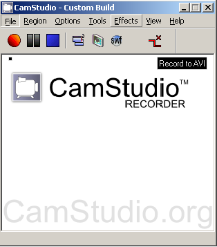
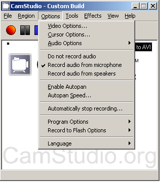
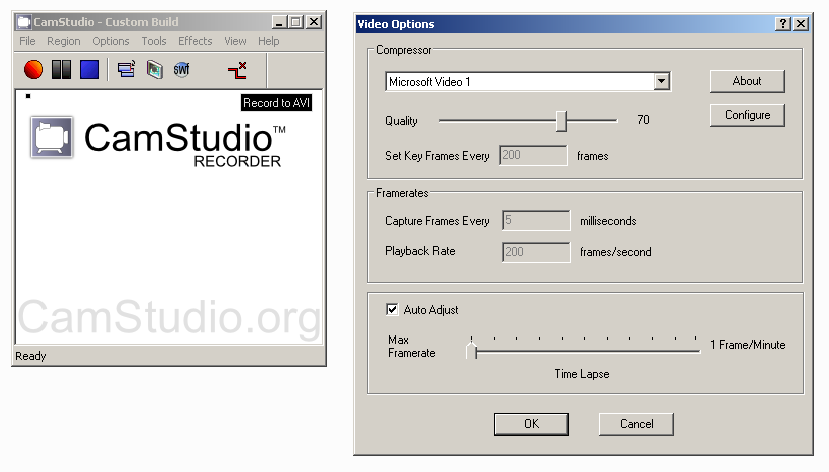
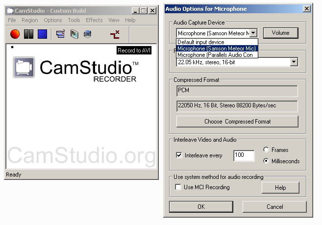
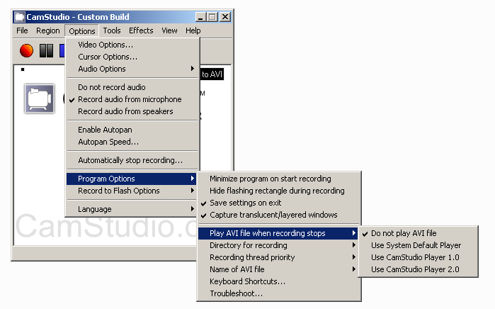
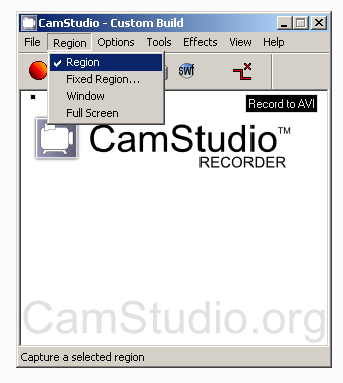

# CamStudio Tutorial

[CamStudio-Homepage](http://camstudio.org)

[CamStudio v2.7.2](http://icdn.camstudiofiles.org/CamStudioSetup_v2.7.2.exe)

## Einstellungen

### Video Einstellungen

- Options
	- Video Options
		- Compressor
			- Microsoft Video 1
			- Quality hab ich in Moment auf 70 stehen gelassen

### Sound Einstellungen

- Options
	- Audio Options
		- Audio Options for Microphone
			- richtige Mikrofon auswählen(bei uns Samsung USB)
- Record Audio from Microphone muss gesetzt sein!!!

### allgemeine Einstellungen

- Options
	- Save Settings on Exit
	- Play avi when Recording stops
	- Program Options
		- Directory for Recording
	- Name for avi-File
		- Ask for filename

### Region / Bereich festlegen

1. Region
	- man kann eine Region per Maus festlegen
2. Fixed Region
	- muss Koordinaten festlegen
3. Window
	- man kann vor der Aufzeichnung ein Fenster festlegen
4. Full Screen
	- erklärt sich von selbst...

## Start
- Aufnahme Button drücken und los gehts
- nach Ende Stop Button drücken
- Verzeichnis und Dateiname auswählen

## Eigenheiten unserer Ausrüstung
- Micro leuchtet blau...nimmt auf
- Micro leuchtet orange...STUMM
- virtueller Maschine zuweisen;) (Parallels)